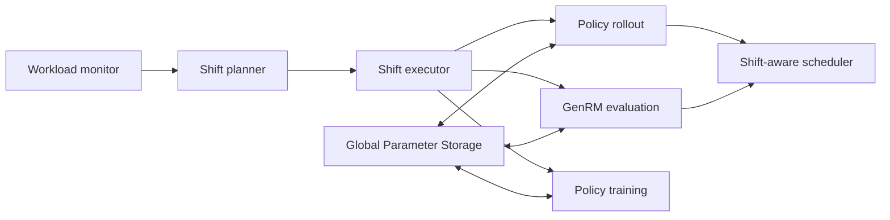

# PivotRL

**Accelerating LLM reinforcement learning with generative rewards via resource shifting**

PivotRL is an LLM reinforcement-learning post-training system that dynamically reallocates GPUs among policy rollout, generative reward-model (GenRM) evaluation, and policy training. Unlike colocated and disaggregated deployments with fixed resource assignments, PivotRL tracks the changing workload of each stage and shifts resources to the current bottleneck.

PivotRL is built on [veRL](https://github.com/volcengine/verl) and supports synchronous and asynchronous post-training, streaming rollout, staleness control, and parameter synchronization through distributed CPU memory.

## Motivation

A post-training step with a GenRM contains three GPU-intensive stages:

1. The policy model generates responses.
2. The GenRM reasons over the responses and produces fine-grained rewards.
3. The policy is updated from the resulting training batch.

The load of these stages changes continuously. Rollout and reward evaluation lose active sequences as a batch reaches its tail, while training waits for a complete batch and becomes idle again after the update. Static GPU partitions therefore leave throughput headroom even when the cluster as a whole is busy.

PivotRL introduces **resource-shiftable deployment**: GPUs are reassigned at runtime so that available capacity follows the workload.



## Design

### Resource-shiftable runtime

The **Global Parameter Storage (GPS)** keeps the policy and GenRM parameters in distributed CPU memory. Any GPU can read the model required by its new role, independent of the current GPU allocation or parallelism layout. After each policy update, training writes the latest policy parameters back to GPS.

Role changes use a unified shift-down/shift-up mechanism:

- Temporary state such as KV cache and activations is discarded and reconstructed lazily.
- Model parameters are discarded on shift-down and read from GPS on shift-up.
- Stateful data such as optimizer states and CUDA graphs is offloaded to CPU memory and restored when needed.
- Small persistent state, including CUDA contexts and communication groups, remains on the GPU.

Rollout and reward evaluation shift at replica granularity, while training shifts as a unit.

### Shift-aware scheduling

Rollout and reward evaluation share the same scheduling design. A throughput model estimates the marginal benefit of assigning each sequence to each replica, and a shared waiting queue dispatches work to maximize aggregate throughput.

When resources shift, affected sequences are aborted, returned to the queue, and dispatched again. The destination recomputes its KV cache through re-prefill, allowing active work to migrate instead of waiting for the original replica to finish.

### Shift planner

The planner continuously uses monitored workload state to:

1. Select the role that needs additional resources.
2. Construct feasible donor/receiver shift pairs.
3. Build a compact candidate set with dynamic programming.
4. Estimate aggregate throughput after sequence migration.
5. Execute the candidate whose expected gain exceeds its shifting penalty.

If no candidate has a positive estimated benefit, PivotRL keeps the current allocation.

## Paper results

The paper evaluates PivotRL on 128 NVIDIA H20 GPUs with four policy/GenRM pairs spanning dense and mixture-of-experts models:

| Policy model | Generative reward model |
| --- | --- |
| Qwen2.5-1.5B | GLM-Z1-9B |
| Qwen2.5-7B | Qwen3-30B-A3B |
| Qwen2.5-32B | Qwen3-30B-A3B |
| Qwen2.5-72B | Qwen3.5-122B-A10B |

Across these settings, the paper reports:

- **1.81-2.05x** end-to-end throughput over colocated deployment.
- **1.50-1.95x** end-to-end throughput over disaggregated deployment.
- **1.66-1.97x** end-to-end throughput over rollout-reward colocated deployment.
- Resource shifts complete within seconds, and sequence-migration overhead remains below 1.18 seconds in the evaluated configurations.
- Reward and AIME@1 curves remain comparable by RL step; PivotRL reaches the same levels in about 30 hours, versus more than 50 hours for the colocated and disaggregated baselines.

These figures are measurements from the paper's hardware, workloads, and tuned baseline configurations; results on other clusters may vary.

## Installation

### Requirements

- Linux
- Python 3.10 or newer (Python 3.11 is recommended)
- CUDA 12.8
- GCC 9 or newer
- NVIDIA GPUs connected by a high-bandwidth interconnect for multi-node runs

Create an environment and install the framework dependencies:

```bash
conda create -n pivotrl python=3.11
conda activate pivotrl

# Set these only when reusing existing editable checkouts.
# export VLLM_PATH=/path/to/vllm
# export VERL_PATH=/path/to/verl

bash scripts/install_basic.sh
bash scripts/install_nixl.sh
bash scripts/install_megatron.sh
bash scripts/install_tms.sh
pip install -e .
```

The installation scripts pin the versions used by this repository, including PyTorch 2.9.1 with CUDA 12.8, vLLM, veRL, NIXL, Megatron-Core, and Torch Memory Saver.

## Running PivotRL

The launchers under `examples/deployment_modes*` are cluster templates. Before running one, update the workspace, model, dataset, environment bootstrap, and node topology in its `_common_deployment.sh` and mode script. In particular, the checked-in templates contain cluster-specific paths and expect variables such as `LOCAL_IP` to be provided by the runtime environment.

For an eight-node Elastic RL launch using the default template:

```bash
bash examples/deployment_modes/mode5_elastic_rl.sh
```

Run a smaller smoke configuration by passing `1` as the first argument:

```bash
bash examples/deployment_modes/mode5_elastic_rl.sh 1
```

To align the data selection with the paper's DAPO-Math-17k training setup:

```bash
PIVOTRL_DEPLOY_DATASET=dapo \
  bash examples/deployment_modes/mode5_elastic_rl.sh
```

Common overrides include:

| Variable | Purpose |
| --- | --- |
| `PIVOTRL_DEPLOY_MODEL_PATH` | Policy-model path |
| `PIVOTRL_DEPLOY_RM_MODEL_PATH` | Generative reward-model path |
| `PIVOTRL_DEPLOY_ROLLOUT_TP` | Rollout tensor-parallel size |
| `PIVOTRL_DEPLOY_RM_TP` | GenRM tensor-parallel size |
| `PIVOTRL_DEPLOY_DATASET` | `dapo`, `gsm8k`, or `mixed` |
| `STALENESS` | Maximum policy-version lag for asynchronous training |
| `PIVOTRL_CANDIDATE_EVALUATION_BACKEND` | `cpp` or `python` planner evaluator |

Additional Hydra overrides can be appended to a mode launcher. See the comments in [`examples/deployment_modes/_common_deployment.sh`](examples/deployment_modes/_common_deployment.sh) for the full configuration surface.

## Deployment modes

The repository includes comparable launchers for the deployment paradigms evaluated in the paper and for an additional trainer-pool baseline:

| Mode | Resource organization | Launcher |
| --- | --- | --- |
| Disaggregated | Fixed, independent rollout, reward, and training pools | [`mode1_disaggregated.sh`](examples/deployment_modes/mode1_disaggregated.sh) |
| Colocated | All roles time-share the training pool | [`mode2_colocated.sh`](examples/deployment_modes/mode2_colocated.sh) |
| Rollout-reward colocated | Rollout and GenRM share a pool; training is isolated | [`mode3_rollout_rm_colocated.sh`](examples/deployment_modes/mode3_rollout_rm_colocated.sh) |
| Trainer-pool only | Fixed extra inference replicas use idle training GPUs | [`mode4_trainer_pool_only.sh`](examples/deployment_modes/mode4_trainer_pool_only.sh) |
| Elastic RL | The planner dynamically shifts GPUs across roles | [`mode5_elastic_rl.sh`](examples/deployment_modes/mode5_elastic_rl.sh) |

Model-specific variants for the paper's 30B, 70B, and Qwen7B/GenRM32B settings are available in the corresponding `examples/deployment_modes_*` directories.

## Repository layout

```text
pivotrl/
  trainer/                  RL orchestration and Hydra configuration
  workers/ps/               parameter storage and synchronization
  workers/gen/              policy rollout and scheduling
  workers/reward/           generative reward evaluation and routing
  utils/elastic_rm/         workload monitor, shift planner, and executor
  utils/nixl/               distributed CPU-GPU parameter transport
examples/deployment_modes*/ deployment and evaluation launchers
tools/elastic_simulator/    standalone C++ shift-candidate simulator
scripts/                    installation and model-conversion utilities
```

The optional C++ candidate evaluator reduces planner simulation overhead. Build and configure it by following [`tools/elastic_simulator/README.md`](tools/elastic_simulator/README.md).

## Contributing

Contributions are welcome. Install and run the pre-commit checks before submitting a change:

```bash
uv pip install pre-commit
pre-commit install
pre-commit run --all-files --show-diff-on-failure --color=always
```

## Acknowledgements

PivotRL builds on [veRL](https://github.com/volcengine/verl) and draws inspiration from the broader LLM post-training ecosystem, including vLLM, OpenRLHF, AReaL, and NeMo-RL.

## License

This project is released under the [Apache License 2.0](LICENSE).
